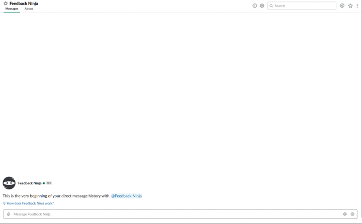

#  Feedback Ninja
A slack bot to send anonymous feedback

## What This Is
- A slack bot using GO to send anonymous feedback to a feedback channel

## How to Use
All you need to do is send a message to the bot and the bot will send that message anonymously to a channel of your choice

- **Send Feedback:**

- **Cancel Feedback:**

## How to Install
### What You Need Before Deploying / Developing
- Create a feedback channel
- create a new slack app in your slack workspace [link](https://api.slack.com/apps)

**Note:**  slack token is **Bot User OAuth Access Token** found in [https://api.slack.com/apps/<app_id>/oauth?](https://api.slack.com/apps/<app_id>/oauth?)

### Deployment with Docker
- Add environment variables following [.env](.env.docker.sample)
- Make sure you have a proxy pointing to your `PORT` in [.env file](.env.docker.sample) file
- Deploy the service wherever you want using the dockerfile included
- Add the url pointing to the proxy to event subscribtions -> [https://api.slack.com/apps/<app_id>/event-subscriptions?](https://api.slack.com/apps/<app_id>/event-subscriptions?)
- Add the same url pointing to proxy `/confirmation` to interactive messages -> [https://api.slack.com/apps/<app_id>/interactive-messages?](https://api.slack.com/apps/<app_id>/interactive-messages?)
- Send a message to bot and watch the magic happen 🎩

### Deployment with Zeit Now
- Make sure you have [zeit now cli](https://github.com/zeit/now) installed
- Login using `now login`
- Add the secrets found in [now.json](now.json) using `now add`
- Deploy by running `now` or `now --prod`
- Get your app link from **Zeit Dashboard** and add it to event subscription
- Add the same url `/confirmation` to interactive messages -> [https://api.slack.com/apps/<app_id>/interactive-messages?](https://api.slack.com/apps/<app_id>/interactive-messages?)

### What You Should Do After Deploying
- Add a bot user to the slack app
- Add event subscription for `message.im`
- Add `chat:write:bot` permission in [https://api.slack.com/apps/<app_id>/oauth?](https://api.slack.com/apps/<app_id>/oauth?)
- Install app

### Development
**After doing the steps in previous section you should do the following for local development / testing**
- Make sure you have **docker version: 19.x+** installed
- Run `docker-compose up --build` in root of project
- Add the link found in [localhost:4040](http://localhost:4040) to event subscribtions -> [https://api.slack.com/apps/<app_id>/event-subscriptions?](https://api.slack.com/apps/<app_id>/event-subscriptions?)
- Add the same link `/confirmation` to interactive messages -> [https://api.slack.com/apps/<app_id>/interactive-messages?](https://api.slack.com/apps/<app_id>/interactive-messages?)
- Send a message to bot and watch the magic happen 🎩

## Technologies used
- Golang
- [nlopes/slack](https://github.com/nlopes/slack)
- [ngrok](https://ngrok.com/)
- Docker
- Docker-compose
- [zeit/now](https://github.com/zeit/now)
